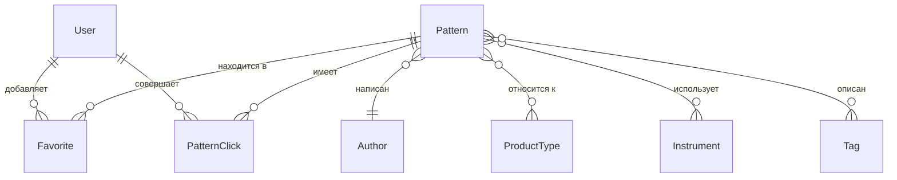

# Финальная Архитектура Данных: Backend MVP

Данный документ описывает финальную архитектуру базы данных для Telegram Mini App каталога вязальных описаний, учитывая обновленные требования по тегам, типам изделий, инструментам и алгоритмам фильтрации.

---

## 1. Анализ полей `isSubscriber` и `isAdmin`

**Поле `isSubscriber` (Удалено)**
Поскольку подписка на канал проверяется при каждом открытии приложения (обычно через Telegram API или валидацию `initData` от бота), хранение статуса `isSubscriber` в базе данных приведет к рассинхронизации. Например, пользователь может отписаться от канала, но в базе он останется подписчиком до следующего "проверочного" захода.
*Оптимальное решение:* Убрать поле из базы. Авторизация и доступ к каталогу должны проверяться на уровне middleware Node.js при каждом входе/запросе, опираясь на свежие данные от Telegram API.

**Поле `isAdmin` (Удалено)**
Поскольку администратор всего один и админка представляет собой отдельное приложение, хранение ролей в таблице `User` избыточно. 
*Оптимальное решение:* Перенести определение администратора на уровень конфигурации (Environment Variables). Например, задать `ADMIN_TELEGRAM_ID=123456789` или `ADMIN_PASSWORD` в `.env`. Это повысит безопасность (невозможно случайно выдать права через БД) и упростит схему.

---

## 2. Финальный список сущностей

1. **`User`** — подписчики канала (пользователи Mini App).
2. **`Pattern`** — каталог описаний.
3. **`Author`** — авторы описаний.
4. **`ProductType`** — типы изделий (балаклава, джемпер и т.д.).
5. **`Instrument`** — инструменты вязания (спицы, крючок).
6. **`Tag`** — теги характеристик (ажуры, реглан и т.д.).
7. **`Favorite`** — избранное пользователей (Many-to-Many между User и Pattern).
8. **`PatternClick`** — лог переходов по внешним ссылкам (аналитика).

---

## 3. Текстовая ER-диаграмма (Связи)



---

## 4. Все связи между сущностями

*   **Pattern ↔ Author (N:1)**: Каждое описание имеет одного автора. Привязка обязательна.
*   **Pattern ↔ ProductType (N:M)**: Одно описание может быть набором (шапка + шарф).
*   **Pattern ↔ Instrument (N:M)**: Может использоваться несколько инструментов (спицы + крючок).
*   **Pattern ↔ Tag (N:M)**: Одно описание содержит множество тегов, один тег относится к множеству описаний.
*   **User ↔ Pattern через Favorite (N:M)**: Явная транзитная таблица избранного с датой добавления.
*   **User ↔ Pattern через PatternClick (N:M)**: Логирование каждого перехода по ссылке.

*Примечание к N:M*: В Prisma связи многие-ко-многим (ProductType, Instrument, Tag) реализуются через неявные транзитные таблицы (implicit m:n relations), что избавляет от необходимости вручную описывать таблицы-связки в коде схемы, оставляя код чистым.

---

## 5. Итоговая Prisma Schema

```prisma
generator client {
  provider = "prisma-client-js"
}

datasource db {
  provider = "postgresql"
  url      = env("DATABASE_URL")
}

model User {
  id            String         @id @default(uuid())
  telegramId    BigInt         @unique
  firstName     String
  lastName      String?
  username      String?
  
  // Для аналитики
  lastVisitedAt DateTime       @default(now())
  createdAt     DateTime       @default(now())
  updatedAt     DateTime       @updatedAt

  favorites     Favorite[]
  clicks        PatternClick[]

  @@map("users")
}

model Author {
  id        String    @id @default(uuid())
  name      String    @unique
  link      String?
  createdAt DateTime  @default(now())
  updatedAt DateTime  @updatedAt

  patterns  Pattern[]

  @@index([name])
  @@map("authors")
}

model ProductType {
  id        String    @id @default(uuid())
  name      String    @unique // Например: "джемпер", "носки/тапки"
  
  patterns  Pattern[]

  @@map("product_types")
}

model Instrument {
  id        String    @id @default(uuid())
  name      String    @unique // "спицы", "крючок"
  
  patterns  Pattern[]

  @@map("instruments")
}

model Tag {
  id        String    @id @default(uuid())
  name      String    @unique // "ажуры", "реглан"
  
  patterns  Pattern[]

  @@map("tags")
}

model Pattern {
  id             String         @id @default(uuid())
  slug           String         @unique
  title          String
  description    String?        
  imageUrl       String?        
  externalLink   String         
  
  // Флаги бизнес-логики
  isFree         Boolean        @default(false)
  isNew          Boolean        @default(false)
  isPublished    Boolean        @default(false)
  
  // Денормализованные счетчики (для раздела "Популярное")
  clicksCount    Int            @default(0)
  favoritesCount Int            @default(0)

  // Внешний ключ
  authorId       String
  author         Author         @relation(fields: [authorId], references: [id], onDelete: Restrict)
  
  // M:N связи
  productTypes   ProductType[]
  instruments    Instrument[]
  tags           Tag[]
  
  // 1:N связи
  favoritedBy    Favorite[]
  clicksLogs     PatternClick[]

  createdAt      DateTime       @default(now())
  updatedAt      DateTime       @updatedAt

  @@index([isPublished])
  @@index([isNew])
  @@index([isFree])
  @@index([authorId])
  @@map("patterns")
}

model Favorite {
  id        String   @id @default(uuid())
  userId    String
  user      User     @relation(fields: [userId], references: [id], onDelete: Cascade)
  patternId String
  pattern   Pattern  @relation(fields: [patternId], references: [id], onDelete: Cascade)
  
  createdAt DateTime @default(now())

  @@unique([userId, patternId])
  @@index([userId])
  @@index([patternId])
  @@map("favorites")
}

model PatternClick {
  id        String   @id @default(uuid())
  patternId String
  pattern   Pattern  @relation(fields: [patternId], references: [id], onDelete: Cascade)
  userId    String?
  user      User?    @relation(fields: [userId], references: [id], onDelete: SetNull)

  createdAt DateTime @default(now())

  @@index([patternId])
  @@index([createdAt])
  @@map("pattern_clicks")
}
```

---

## 6. Проверка на нормализацию и отсутствие дублирования

**Нормализация:**
Схема соответствует 3-й нормальной форме (3NF):
*   Все атрибуты зависят только от первичного ключа.
*   Многозначные атрибуты (теги, инструменты, типы изделий) вынесены в отдельные таблицы и связаны через связи M:N.
*   Отсутствует транзитивная зависимость (информация об авторе хранится в отдельной таблице, а не дублируется в каждом `Pattern`).

**Дублирование данных:**
*   Дублирования нет. Справочники (ProductType, Instrument, Tag, Author) хранятся в единственном экземпляре.
*   *Исключение (Осознанная денормализация):* Поля `clicksCount` и `favoritesCount` в таблице `Pattern`. Они являются производными от таблицев `PatternClick` и `Favorite` соответственно. Это сделано специально для производительности на чтение (описание ниже).

---

## 7. Потенциальные проблемы будущего масштабирования

Поскольку текущий каталог MVP рассчитан на 200–300 записей (и пагинацию по 10 элементов), текущая архитектура будет работать мгновенно и не потребует усложнений в ближайшие год-два. 

Однако при росте проекта (например, до 100 000+ описаний и миллионов пользователей) могут возникнуть следующие моменты:

1.  **Поиск по тексту (Название, Автор, Теги):**
    *   *Проблема:* При увеличении каталога стандартный поиск базы через `ILIKE '%query%'` начнет тормозить, так как он не использует индексы (B-Tree).
    *   *Решение:* Замена на PostgreSQL Full Text Search (индексы GIN/GiST).
2.  **Сортировка "Новинки" / "Популярные":**
    *   *Проблема:* Сортировка всей таблицы по полям `clicksCount DESC` с применением множества фильтров на больших объемах данных может стать узким горлышком.
    *   *Решение:* Применение составных индексов под конкретные запросы каталога, переход на курсорную пагинацию (cursor-based pagination) вместо `OFFSET` в Prisma.
3.  **Таблица логов `PatternClick`:**
    *   *Проблема:* Таблица логов кликов будет расти очень быстро при высокой активности. Запросы "клики за эту неделю" начнут замедляться.
    *   *Решение:* Партиционирование PostgreSQL таблицы `pattern_clicks` по месяцам/неделям или вынос аналитики в ClickHouse.

**Вывод:**
Для MVP (200-300 записей) схема идеальна. Справочные таблицы `ProductType`, `Instrument`, `Tag` обеспечат консистентность фильтров, а вынос `isNew` и `isPublished` даст администратору полный контроль над выдачей в приложении. Схему можно смело брать в разработку.
