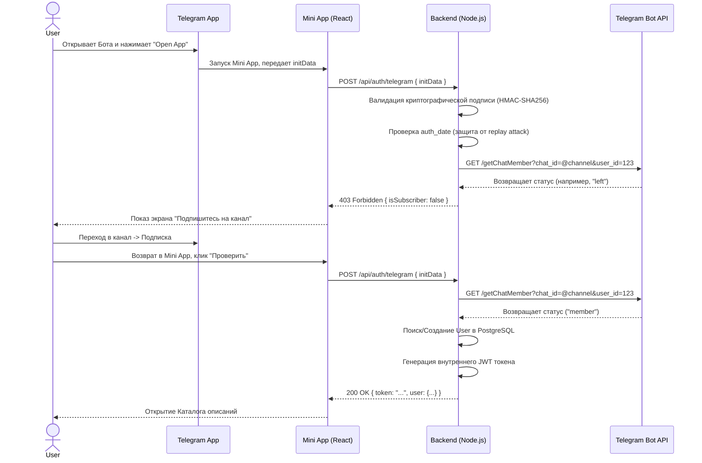

# Архитектура Telegram Mini App и Аутентификации

Документ содержит архитектурный анализ интеграции Telegram Mini App, описание процесса аутентификации пользователя, механизма проверки подписки на канал и оценки рисков.

---

## 1. Жизненный цикл пользователя (User Lifecycle)

1.  **Вход:** Пользователь открывает Telegram-бота проекта и нажимает кнопку (Menu Button или Inline Keyboard) для запуска приложения.
2.  **Инициализация:** Открывается Web App (Frontend). Telegram SDK передает приложению строку `initData` (содержит ID, имя, юзернейм и криптографическую подпись).
3.  **Авторизация:** Frontend отправляет `initData` на Backend.
4.  **Валидация:** Backend проверяет подпись `initData` с помощью токена бота. Если данные подлинные, извлекает Telegram User ID.
5.  **Проверка подписки:** Backend делает запрос к Telegram Bot API (`getChatMember`), чтобы узнать статус пользователя в заданном публичном канале.
6.  **Блок (Подписки нет):** Если статус `left` (или ошибка), Backend возвращает ответ об отсутствии доступа. Frontend показывает экран "Ой, вы не подписаны" со ссылкой на канал и кнопкой "Проверить".
7.  **Успех (Подписка есть):** Если статус `member`/`administrator`/`creator`, Backend проверяет наличие пользователя в нашей БД (создает нового, если нет, обновляет данные `lastVisitedAt`).
8.  **Сессия:** Backend генерирует внутренний JWT-токен и отдает его Frontend'у. 
9.  **Использование:** Frontend сохраняет токен и перенаправляет пользователя в Каталог. При всех последующих запросах к API используется JWT-токен.

---

## 2. Sequence Diagram (Жизненный цикл)



---

## 3. Необходимые объекты Telegram

Для реализации архитектуры необходимо настроить три сущности:
1.  **Telegram Bot (@BotFather):** Точка входа в Mini App. Токен этого бота вписывается в `.env` бэкенда для криптографической валидации данных и запросов к API.
2.  **Mini App (Web App):** Настраивается в BotFather (команда `/newapp` или привязка к кнопке меню). Требует HTTPS-домена (поэтому потребуется Nginx/SSL).
3.  **Публичный Канал:** Канал, на который осуществляется подписка. **Важно:** Бот должен быть добавлен в этот канал как Администратор, иначе он не сможет вызывать метод `getChatMember`.

---

## 4. Как backend получает Telegram User ID

Frontend передает на Backend сырую строку `window.Telegram.WebApp.initData`.
После успешной криптографической валидации (см. п.5), Backend парсит эту строку как обычный URL query string. Одно из полей в ней называется `user`, оно содержит JSON-строку:
```json
{"id": 123456789, "first_name": "Иван", "last_name": "Иванов", "username": "ivanov"}
```
Из этого JSON бэкенд и достает ID пользователя.

---

## 5. Как backend валидирует Telegram InitData

Чтобы злоумышленник не мог отправить поддельный User ID, Telegram подписывает данные. Алгоритм на Node.js:
1.  Из строки `initData` извлекается параметр `hash`.
2.  Остальные параметры сортируются по алфавиту и склеиваются в строку формата `key1=value1\nkey2=value2`.
3.  Создается секретный ключ (HMAC-SHA256 хеш от токена бота со строкой `"WebAppData"`).
4.  Этим секретным ключом хешируется собранная строка (HMAC-SHA256).
5.  Если полученный хеш совпадает с `hash` из `initData` — данные подлинные и не изменялись.
6.  *Дополнительно:* проверяется поле `auth_date` (дата создания подписи), чтобы отбросить устаревшие запросы (старше 5-10 минут) во избежание Replay-атак.

---

## 6. Как backend проверяет подписку на канал

Backend отправляет серверный HTTP-запрос (сервер-сервер) к Telegram Bot API:
`GET https://api.telegram.org/bot<BOT_TOKEN>/getChatMember?chat_id=@имя_канала&user_id=<TELEGRAM_USER_ID>`

В ответе проверяется поле `result.status`:
*   *Доступ разрешен:* `member`, `administrator`, `creator`.
*   *Доступ запрещен:* `left`, `kicked`, `restricted`.

---

## 7. Ограничения Telegram для проверки подписки

*   **Rate Limits (Лимиты запросов):** Telegram API строго ограничивает количество вызовов. Если приложение откроют сотни пользователей одновременно, массовый вызов `getChatMember` приведет к ошибке `429 Too Many Requests`.
*   **Решение:** Бэкенд **не должен** вызывать `getChatMember` при каждом клике пользователя внутри приложения. Достаточно проверить это один раз при входе, после чего выдать внутренний JWT-токен со сроком жизни, например, 1-2 часа. Пока JWT жив — считаем пользователя подписчиком. Когда JWT протухает — тихо делаем refresh и снова проверяем подписку через Telegram API.

---

## 8. Какие данные пользователя сохранять в БД

Хотя данные приходят из Telegram, мы сохраняем минимальный набор:
1.  `telegramId` (BigInt) — как уникальный идентификатор.
2.  `firstName`, `lastName`, `username` — для админки и аналитики (данные могут обновляться при каждом логине, так как в TG они могут меняться).
3.  `createdAt` — дата первого входа.
4.  `lastVisitedAt` — дата последнего входа (обновляется при каждом успешном `POST /api/auth/telegram`).

*Пароли, логины и хэши не хранятся, безопасность делегирована Telegram.*

---

## 9. API Endpoints только для Telegram-авторизации

Для этой части требуется ровно **один** endpoint:

**`POST /api/auth/telegram`**
*   **Тело запроса:** `{ "initData": "query_id=...&user=...&hash=..." }`
*   **Логика:** Валидация -> Запрос к TG API -> Поиск в БД -> Генерация JWT
*   **Ответ (успех):** `{ "token": "eyJhbGci...", "user": { "firstName": "Иван" }, "isSubscriber": true }`
*   **Ответ (нет подписки):** `403 Forbidden { "isSubscriber": false }`
*   **Ответ (поддельный initData):** `401 Unauthorized`

---

## 10. Риски архитектуры

1.  **Исключение бота из канала:** Если администратор случайно удалит бота из канала или лишит прав администратора, `getChatMember` сломается (будет падать с ошибкой 400+), и ни один пользователь не сможет войти в приложение.
2.  **Зависимость от Telegram API:** Если у Telegram падают сервера или они недоступны из-за блокировок РКН/провайдеров на сервере бэкенда, вход в приложение станет невозможен.
3.  **Устаревание InitData:** Если не реализовать проверку поля `auth_date`, то украденный `initData` позволит злоумышленнику входить под чужим аккаунтом бессрочно.

---

## 11. Что может потребовать переделки в будущем

1.  **Переход от синхронного `getChatMember` к Webhook/Redis:** Если проект станет высоконагруженным, синхронный запрос к Telegram при каждом логине станет узким горлышком. Потребуется подписать бота на события `chat_member` (уходы/приходы в канал через вебхуки) и хранить статусы подписчиков в Redis/БД в реальном времени.
2.  **Кэширование сессий:** Внедрение Refresh Tokens для обеспечения гладкого опыта (пользователь свернул приложение, вернулся через день — токен обновился в фоне без показа экранов загрузки).
